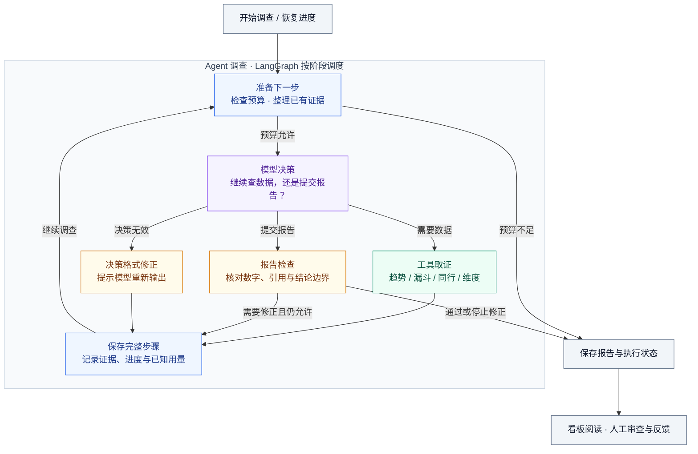

# 电商经营诊断 Agent

**发现值得关注的变化，整理可核对的事实，给出下一步核查建议。**

面向电商运营的经营分析 Agent。它从访客、转化与成交异常出发，选择数据工具展开调查，生成包含证据、待核实原因和行动建议的报告，再由运营人员结合业务记录复核。

当前适合**本地演示和有人工复核的内部分析**。例如，“有浏览和加购，但没有成交”值得调查，却不足以直接认定支付故障。项目希望把这类判断过程说明白，让使用者知道结论依据什么、还缺什么。

[能做什么](#能做什么) · [执行流程](#一次诊断怎样执行) · [报告示例](#报告怎样阅读) · [快速开始](#快速开始) · [技术分工](#框架与项目各负责什么)

## 能做什么

| 你关心的问题 | 项目提供的能力 |
|---|---|
| **哪些商品值得关注？** | 按规则检测指标变化，将异常、诊断状态和报告汇总到运营看板 |
| **变化发生在哪里？** | Agent 根据已有结果选择趋势、漏斗、同行或维度查询，继续收集证据 |
| **结论有什么依据？** | 报告关联查询结果，区分观察事实、待核实解释和行动建议 |
| **调查中断了怎么办？** | 后台任务保存完整步骤；满足身份、状态和剩余预算条件时，接续执行 |
| **反馈怎样用到下次？** | 整理经验草稿，经人工核对、确认并授权后，供后续同类调查参考 |

看板还提供任务状态、工具调用、耗时和模型用量，便于查看一次调查的过程与开销。

## 一次诊断怎样执行

异常检测或接口请求先创建任务，**Worker（后台执行进程）**领取后启动 Agent。Agent 核对任务身份与预算，必要时恢复已保存的进度，再进入下面的调查流程。



图中展示主要分支。超时、模型故障或其他停止条件也会结束本轮调查并记录状态；结束可能是成功、未完成、失败，或等待符合条件的重试。

- **六个阶段属于一个 Agent。** 调查图中只有“模型决策”请求诊断模型；数据查询、报告检查和存档由代码完成，不另请模型审稿。
- **查询不走固定清单。** 模型根据问题与证据选择工具，不要求每次把四个工具全部调用一遍。
- **检查通过仍需业务复核。** 规则检查能拦截已知的数字、引用和过度推断问题，不能证明所有结论正确，也允许报告保留“原因未知”。
- **恢复沿用原预算。** 已保存的完整步骤可以复用；中断前尚未落盘的请求仍可能重做，不保证零重复调用。

### 工具能查到什么

| 工具 | 回答的问题 | 使用时的边界 |
|---|---|---|
| **趋势指标** `metric` | 这段时间怎样变化？与上一窗口相比怎样？ | 先看两期记录是否齐全、成交样本是否足够；缺记录不能直接当零 |
| **转化漏斗** `funnel` | 浏览、加购、成交各有多少？ | 当前没有完整支付事件链，不能仅凭成交少就定位支付故障 |
| **同行比较** `peer` | 同一窗口内，与同类商品相比怎样？ | 只有当前窗口横向比较，不能据此判断大盘历史趋势 |
| **维度分析** `dimension` | 工作日/周末、新老用户等切片有什么差异？ | 只能分析已接入的切片；差异本身不证明原因 |

## 报告怎样阅读

**发生了什么 → 变化集中在哪里 → 哪些尚未确认 → 下一步查什么。**

下面是表达方式示意，不是某次真实诊断的结果：

> **观察事实**：本期有浏览和加购，未记录成交；上期成交样本也较少。
>
> **尚未确认**：现有数据不足以确定原因，需要核对订单、商品状态及数据采集记录。
>
> **下一步**：由运营检查对应日期的订单与商品变更记录，补充实际核查结果。
>
> **核查目标**：确认数据是否完整，记录哪些解释获得支持、哪些仍未确定。

正式报告提供证据引用，以及建议的责任角色、优先级和核查目标。**建议不会自动执行。** 用户填写反馈后，可以请求模型整理经验草稿；草稿须人工确认，且另行授权后才用于后续同类调查。授权可以停用，原始反馈和来源记录仍保留。

### 理解数据与结果

当前主要适配 **Retailrocket 行为与商品数据**，也支持导入日统计 CSV。接入自己的业务前，应核对字段映射、计算公式和数据权限。

- **访客与成交有具体口径。** 按日 UV 累加不是整个窗口内的去重访客数；小样本下的比例变化需要谨慎解读。
- **金额可能是估算值。** 当前 Retailrocket 适配用成交笔数乘商品最新价估算 GMV，货币单位与历史价格仍需核实；窗口差额不能当作实际损失。
- **现有证据主要反映观察与相关性。** 支付故障、活动效果或其他经营原因，需要额外业务记录支持。

## 快速开始

以下是 **Windows PowerShell 的本地运行流程**，准备 Python 3.14 和可访问的 MySQL 数据库；真实诊断另需 DeepSeek API Key。前端由 FastAPI 直接提供，**不用单独启动 Node 前端服务**。

Linux/macOS 可使用同一套 Python 入口，但需将解释器路径换为 `.venv/bin/python`，并调整环境创建与文件复制命令。

### 1. 安装与配置

```powershell
git clone https://github.com/Sh1eepy/ecommerce-diagnosis.git
cd ecommerce-diagnosis

# 首次安装才创建环境；已有 .venv 时复用
if (-not (Test-Path .venv)) { py -3.14 -m venv .venv }
.\.venv\Scripts\python.exe -m pip install -r requirements.txt

# 保留已有配置，不覆盖 .env
if (-not (Test-Path .env)) { Copy-Item .env.example .env }
```

安装后按 [.env.example](.env.example) 编辑 `.env`，重点核对：

| 配置 | 用途 |
|---|---|
| `DB_HOST`、`DB_PORT`、`DB_NAME` | 指向已创建的目标数据库 |
| `DB_READ_*`、`DB_WRITE_*` | 分别用于工具查询与业务写入；数据库账号权限需实际配置 |
| `LLM_API_KEY` | 服务端调用模型的密钥，不能填到看板登录框 |
| `API_KEY_SCOPES` | 为后端访问密钥分配读取报告、发起诊断、提交反馈等权限 |
| `AGENT_*`、`ALERT_WEBHOOK_URL` | 调查预算与告警配置；首次本地试用可将告警地址留空 |

替换模板中的示例密码与密钥，勿提交 `.env`。预算限制帮助控制请求，不是供应商账单硬上限；看板费用按已知用量和配置单价估算。

### 2. 启动 API 和看板

```powershell
.\.venv\Scripts\python.exe -m uvicorn app.api.main:app --host 127.0.0.1 --port 8000
```

启动会检查数据库结构并创建缺失的业务表。已有旧库可先运行 [迁移检查脚本](scripts/migrate_worker_schema.py) 预览所需变更；该脚本默认不应用修改，实际迁移前应停服务并备份。

| 入口 | 用途 |
|---|---|
| [运营看板](http://127.0.0.1:8000/api/v1/monitoring/dashboard) | 查看异常、报告、任务与用量 |
| [健康检查](http://127.0.0.1:8000/healthz) | 检查 API 与数据库基本连通性，不代表 Worker 正常执行 |
| [OpenAPI](http://127.0.0.1:8000/openapi.json) | 查看接口、字段与请求结构 |

在看板 `X-API-Key` 输入框填写具有 `report:read` 权限的**后端访问密钥**，移出输入框后加载数据。开发模式也支持 `API_KEYS` 中未被显式限制的密钥。密钥不持久保存在页面，刷新后需重新输入。

**只查看已有报告，启动 API 即可。** 无数据的新库不会自动出现示例报告；无需为了打开页面而启动 Worker 或定时调度器。

### 3. 接入数据，创建调查任务

| 数据入口 | 说明 |
|---|---|
| `POST /api/v1/import/daily-stat` | 使用 `data:import` 权限上传日统计 CSV；完整字段见 [数据入口定义](app/api/files.py)。导入是追加写入，重复上传可能重复计数 |
| [Retailrocket 导入脚本](scripts/import_retailrocket.py) | 适配原始行为与商品数据；含清空并重建数据的操作，仅在确认目标库可被重建时使用 |

数据就绪后，另开终端扫描异常：

```powershell
# 以数据最大日期为结束日扫描，并为新异常创建诊断任务
.\.venv\Scripts\python.exe scripts/run_detection.py --days 14
```

只想登记异常、不创建诊断任务，可加 `--no-diagnose`；它仍会写入异常记录。已有异常不会因此自动获得新任务。

也可以用 `diagnosis:create` 权限向 `POST /api/v1/diagnostics` 提交商品 `item_id`、`start_date`、`end_date`。接口默认返回异步任务，使用 `GET /api/v1/tasks/{task_id}` 查询进度；业务请求通过 `X-API-Key` 传递密钥。重复提交同一商品、窗口与异常组合可能复用已有任务。

### 4. 启动 Worker，查看并审查结果

启动前先盘点任务，确认没有重复 Worker，也没有不打算执行的积压任务：

```powershell
# 只读盘点，不领取任务、不调用模型
.\.venv\Scripts\python.exe scripts/worker_preflight.py

# 确认待办范围后执行；会消费队列并调用配置的模型
.\.venv\Scripts\python.exe scripts/run_worker.py
```

Worker 会处理符合条件的待办任务，可能产生模型费用；如果配置了告警，还可能发送通知。首次试用无需启动 Scheduler。需要全天定时检测时，再单独配置调度范围。

回到看板查看结果，打开报告后点击“已审查”填写反馈。可直接保存反馈，也可选择“自动提炼经验并预览”调用模型生成草稿；核对草稿后确认保存，如需未来参考，再勾选经验授权。提交反馈需要 `feedback:create` 权限，仅读取报告的密钥不够。

## 框架与项目各负责什么

| 部分 | 现成组件或技术 | 项目负责的设计 |
|---|---|---|
| **调查流程** | LangGraph `StateGraph`、节点、条件分支、`Runtime` | 每阶段做什么、何时继续或停止、预算和证据如何传递 |
| **模型与工具** | LangChain `BaseChatModel`、`BaseTool`、`StructuredTool` | 默认 DeepSeek 接入、用量与错误处理、四类查询、输入校验和本地审计 |
| **报告质量** | Python 确定性检查 | 核对数值和证据引用，限制无依据的归因，提示修正或保留未完成结果 |
| **任务与恢复** | SQLAlchemy、数据库事务 | 队列、Worker、进度存档、租约和心跳；恢复时核对身份与原预算 |
| **接口与看板** | FastAPI、HTML / JavaScript、ECharts | 数据导入、诊断、报告、反馈与监控入口 |

模型默认使用 DeepSeek 的 OpenAI 兼容接口，也支持接入符合项目调用约定的 LangChain 标准聊天模型。新增工具可使用标准 `BaseTool` / `@tool`，经共用注册表校验与审计；可选 MCP stdio 接口复用查询工具，默认关闭，不是普通诊断的必需环节。

任务恢复目前使用**项目自己的数据库存档，未启用 LangGraph 原生持久化组件**。这样可以在同一事务里核对任务归属再保存结果，避免失去执行资格的旧 Worker 写入；不是安装框架后就自动获得的能力。

进一步理解产品流程见 [项目思路](docs/项目思路.md)。阅读代码可从 [调查图](app/agent/graph.py)、[工具注册表](app/agent/tool.py)、[Worker](app/tasks/worker.py) 和 [人工审查](app/reviews.py) 开始。

<details>
<summary>开发者：检查实际执行图与离线测试</summary>

导出源码对应的完整执行图，不调用模型、不查询或修改数据库：

```powershell
.\.venv\Scripts\python.exe scripts/inspect_agent.py --format mermaid
```

离线回归使用临时 SQLite、Mock 响应和空告警配置，不需要 MySQL 或真实模型密钥。测试会清理自己的临时目录，运行前必须确认 `tests/.pytest_runtime` 的绝对路径位于本项目 `tests` 内：

```powershell
.\.venv\Scripts\python.exe -m pytest -p no:cacheprovider -q -W error::DeprecationWarning
```

使用现有虚拟环境即可，无需执行 `Activate.ps1` 或降低 PowerShell 策略。页面脚本回归依赖 Node.js；缺少时相关测试会跳过，不能视为页面已经验收。CI 另外执行密钥泄漏与依赖漏洞扫描，配置见 [CI 工作流](.github/workflows/ci.yml)。

</details>

## 使用边界

当前定位是有人工复核的经营分析原型。程序测试、单次报告成功或模型自报置信度，都不能证明诊断准确率、MySQL 并发安全或生产可用性。

API 的 scope 控制操作权限，**尚不提供用户或店铺之间的数据隔离**。多人或公网部署前，仍需完善数据归属、最小权限、HTTPS、备份恢复与并发验收；不要直接公开默认开发配置。
