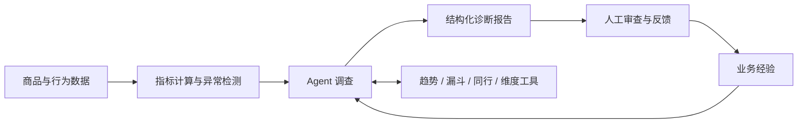

# 电商经营诊断 Agent

**从指标异常到经营报告，让每一次调查都有数据依据。**

面向电商运营的经营分析 Agent：发现访客、转化与成交变化，围绕异常自主选择查询工具，生成包含事实、待核实原因和行动建议的诊断报告。运营人员可以审查结果、补充反馈，将业务经验带入后续调查。

[核心能力](#核心能力) · [工作方式](#工作方式) · [快速开始](#快速开始) · [项目思路](docs/项目思路.md)

## 为什么做这个项目

看到“转化率下降”只是分析的起点。运营还需要核对流量与成交变化、查看浏览和加购情况、比较商品表现，最后决定找谁核查、查什么记录。

这个项目把这些步骤组织成一条连续的工作流：规则筛选值得关注的异常，Agent 调查相关数据，报告汇总观察与建议，人工反馈沉淀为下一次调查的参考。

## 核心能力

| 能力 | 使用体验 |
|---|---|
| **异常发现** | 根据指标规则识别访客、购买转化率、估算成交金额等变化，集中呈现待关注的商品 |
| **自主调查** | 按问题选择趋势、漏斗、同行或人群切片，结合已有结果决定下一步 |
| **证据报告** | 将观察事实、数据依据、待核实原因和核查建议放在同一份报告里 |
| **人工经验** | 从反馈中提炼经验草稿，经人工确认后用于同类异常的后续调查 |
| **运营看板** | 查看异常、诊断报告、审查状态，以及任务、调用耗时与模型用量 |
| **持续执行** | 后台队列管理诊断，保存调查进度，并在可恢复故障后接续执行 |

### 一份报告回答什么

**发生了什么 → 变化集中在哪里 → 还需要确认什么 → 下一步查什么**

报告内容示意：

> **观察**：本期有浏览和加购，尚未记录成交，上期成交样本也较少。
>
> **待核实**：结合订单、商品状态和数据采集记录，判断变化是否具有业务意义。
>
> **建议**：由运营核对对应日期的订单与商品变更记录，并将核查结果补充到报告反馈。

每条建议包含责任角色、优先级和核查目标，便于接入日常运营协作。

## 工作方式



规则负责发现异常，SQL/Python 提供数据事实，LLM 负责选择调查步骤和组织报告。报告中的数字关联查询依据，事实与待验证解释分别呈现，方便运营复核。

当前数据适配基于 Retailrocket 行为数据，适合本地演示和内部经营分析。阅读报告时结合数据覆盖与成交样本判断；估算成交金额采用成交笔数与商品价格的近似口径。

## 快速开始

准备 **Python 3.14、MySQL 数据库和 DeepSeek API Key**。以下以 Windows 为例；Linux/macOS 将虚拟环境解释器路径替换为 `.venv/bin/python`。

### 1. 安装与配置

```powershell
git clone https://github.com/Sh1eepy/ecommerce-diagnosis.git
cd ecommerce-diagnosis

# 首次安装；已有 .venv 时直接复用
py -3.14 -m venv .venv
.\.venv\Scripts\python.exe -m pip install -r requirements.txt

# 首次配置时复制模板，再填写自己的配置
Copy-Item .env.example .env
```

在 `.env` 中填写数据库连接、数据库读写账号、`LLM_API_KEY` 和后端访问密钥。完整选项见 [.env.example](.env.example)。

### 2. 启动 API 和看板

```powershell
.\.venv\Scripts\python.exe -m uvicorn app.api.main:app --host 127.0.0.1 --port 8000
```

打开 [运营看板](http://127.0.0.1:8000/api/v1/monitoring/dashboard)，填写配置中的后端 `API_KEYS`，或 `API_KEY_SCOPES` 中有报告读取权限的密钥。模型密钥由服务端使用。

API 启动会创建缺失的业务表；已有旧库的字段升级可先用 `scripts/migrate_worker_schema.py` 预览。接入数据后，看板会展示对应异常与报告。

### 3. 接入数据并运行诊断

项目提供 Retailrocket 数据适配脚本，也支持通过 `POST /api/v1/import/daily-stat` 上传日统计 CSV；字段定义见 [数据入口](app/api/files.py)。

数据就绪后，在另一个终端运行：

```powershell
# 扫描数据中的近期异常，并为新异常创建任务
.\.venv\Scripts\python.exe scripts/run_detection.py --days 14

# 后台执行诊断；会消费待办任务并调用配置的模型
.\.venv\Scripts\python.exe scripts/run_worker.py
```

也可以通过 `POST /api/v1/diagnostics` 指定商品与日期窗口创建诊断。接口定义见 [OpenAPI](http://127.0.0.1:8000/openapi.json)。

### 4. 审查与积累经验

打开报告，点击“已审查”填写反馈。选择“自动提炼经验并预览”可生成经验草稿；核对、修改并确认保存后，可授权给后续同类诊断参考。模型调用会产生供应商费用，看板提供已知用量及配置单价估算。

## 技术实现

| 部分 | 实现 |
|---|---|
| 服务与存储 | FastAPI · SQLAlchemy · MySQL |
| 调查引擎 | Python Agent Loop · 结构化工具调用 · 证据账本 |
| 模型接入 | DeepSeek · OpenAI 兼容客户端 |
| 任务执行 | 数据库队列 · Worker · Checkpoint · 租约与心跳 |
| 经验管理 | 报告版本审查 · LLM 草稿 · 人工确认 · 同类检索 |
| 界面 | HTML / JavaScript · ECharts |
| 工具扩展 | 共用工具注册表 · 可选 MCP stdio 接口 |

详细的产品流程和架构选择见 [项目思路](docs/项目思路.md)。开发者可从 `app/agent/`、`app/tasks/` 和 `app/reviews.py` 阅读核心实现。
