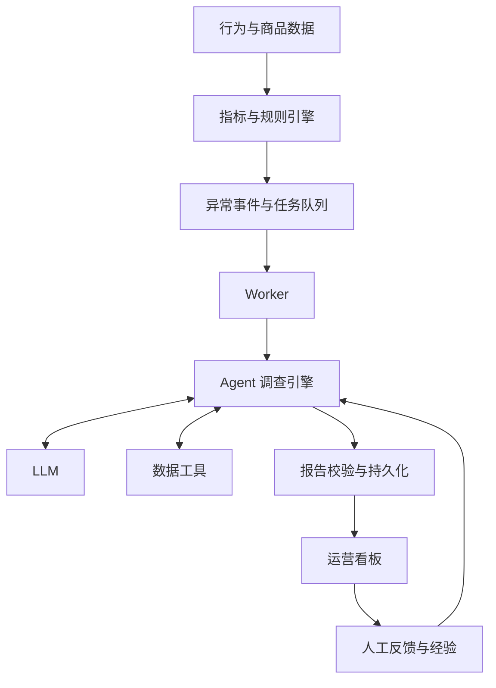

# 项目思路：从异常指标到经营决策参考

## 产品定位

电商经营诊断 Agent 面向日常商品运营中的异常排查场景，将指标监测、数据调查、报告生成和人工反馈连接起来。

产品围绕三个问题展开：**哪些商品值得关注？现有数据说明了什么？接下来应该核查什么？**

运营人员从看板进入具体异常，阅读带有证据的报告，再把业务核查结果补充进系统。Agent 承担重复的数据调查与整理，运营人员负责结合活动、商品、订单等业务背景作出判断。

## 业务场景

| 场景 | 调查重点 | 报告提供的参考 |
|---|---|---|
| 商品访客变化 | 日趋势、相邻窗口、数据覆盖 | 变化发生在哪些日期，以及值得核对的流量或商品记录 |
| 购买转化率变化 | 访客与成交规模、浏览和加购情况 | 各环节的观测值、样本规模及后续核查方向 |
| 估算成交金额变化 | 成交笔数、价格口径和窗口差异 | 金额变化的计算依据与业务解释所需的信息 |
| 商品表现差异 | 当前窗口的同行数据与已有维度切片 | 可供比较的参考值，以及需要进一步调查的商品或人群 |

这些场景共用一套调查流程，工具选择随异常和已获得的证据变化。

## 核心产品流程

### 发现：把关注点收敛到异常事件

数据层将商品行为整理为日指标，规则层识别符合条件的变化。异常事件保存商品、指标、时间窗口、观测值和触发规则，成为后续调查的起点。

看板集中展示事件及诊断状态。运营既可以从自动检测得到的事件进入，也可以通过接口指定商品与时间窗口发起调查。

### 调查：围绕问题组织查询

Agent 先理解异常，再选择需要的证据。每次读取工具结果后，更新当前判断，决定继续查询还是形成报告。

| 工具 | 回答的问题 |
|---|---|
| 趋势指标 metric | 这段时间的数据怎样变化？前后窗口与成交样本是什么情况？ |
| 转化漏斗 funnel | 浏览、加购、成交分别有多少？它们之间的比例是多少？ |
| 同行比较 peer | 同一窗口内，商品与类目中其他商品的表现怎样？ |
| 维度分析 dimension | 已有数据中，工作日/周末或新老用户等切片有什么差异？ |

证据足够时，Agent 收敛为报告；仍需业务信息时，报告会指出待核实内容及获取方向。

### 表达：让报告能够交给运营使用

报告按照四个部分组织：

1. **发生了什么**：指标、窗口与变化的事实描述。
2. **集中在哪里**：已有证据支持的日期、商品或人群观察。
3. **哪些还需确认**：样本规模、数据覆盖及候选解释。
4. **下一步查什么**：带责任角色、优先级和核查目标的建议。

数值与查询依据关联，技术引用可以展开查看。运营首先阅读结论与行动，再按需要回查原值。

### 反馈：把一次调查变成可复用经验

用户审查报告后，可以填写诊断是否符合实际、哪些判断需要调整、业务核查发现了什么。

系统将这段反馈与对应异常关联，调用 LLM 整理出可参考经验、应避免的误判和适用条件。草稿经人工核对或修订后保存，授权的经验会在后续同类调查中加入上下文。经验同时提供 Markdown 阅读副本，便于回顾。

这种设计让产品能吸收运营积累，同时保留原始反馈、来源报告和人工确认的关系。

## 整体架构

**规则与模型分工。** 规则承担可重复的指标筛选，模型承担调查决策和语言表达，SQL/Python 提供可回查的数据。这个划分让模型能力集中在理解问题与组织证据上。

**工作流按阶段组织。** LangGraph 串联预算检查、模型决策、工具取证和报告校验，LangChain 提供模型与工具接口。领域查询、证据引用及任务恢复规则保持独立，便于扩展调查步骤。

**调查过程可追踪。** 每次运行关联模型用量、工具查询、报告与进度存档。后台任务队列承接长耗时调查，Worker 保存完整步骤，结合租约和心跳管理执行状态。

**成本随过程可观察。** 一轮模型响应决定调用工具或生成报告。工具查询由代码执行，其结果进入后续模型上下文。系统整理上下文、限制输出并在预算较少时收尾；看板汇总已知模型用量和费用估算。

**经验由人确认。** 自动提炼减少整理反馈的工作量，确认与授权决定经验何时参与后续诊断。新调查仍结合当前商品数据进行判断。

## 数据与结果的含义

当前数据适配基于 Retailrocket 的行为、商品属性和类目数据，也支持接入日统计 CSV。核心指标包括访客数、浏览量、加购量、成交笔数、购买转化率和估算成交金额。

报告会结合前后窗口覆盖与成交样本描述观察；日访客汇总和估算成交金额沿用当前数据口径。涉及原因定位、活动效果或实际金额的判断，需要业务记录共同支持。当前产品适合有人工复核的经营分析流程。

## 扩展方向

项目按数据、工具、模型、任务与展示分层，便于围绕具体业务扩展：

- **接入业务数据**：增加订单、商品或运营记录的映射，统一指标含义。
- **增加调查工具**：通过 LangChain 标准工具接口接入，经工具注册表校验和审计，让 Agent 获得新的证据来源。
- **替换模型与检查流程**：支持符合调用约定的 LangChain 标准聊天模型；运行依赖与图状态分开，可在本地检查图结构和接口定义。
- **接入其他应用**：通过 API 使用诊断与报告，或通过可选 MCP 接口复用查询工具。
- **积累领域经验**：围绕具体业务建立人工审查与反馈记录，逐步丰富同类问题的参考。

产品的核心思路是将“发现异常、收集证据、形成建议、业务复核”组织为一条可持续使用的工作流。
