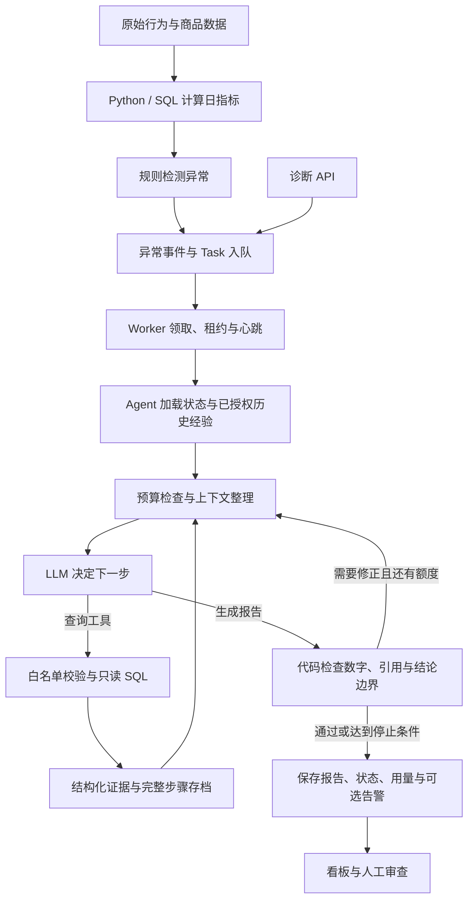

# 项目流程与模型用量

本项目使用规则发现异常、LLM 选择调查步骤、只读工具提供证据，再由确定性代码检查报告。它是单个 Agent 的循环，不是多个模型角色各自调用一次的流水线。

## 1. 从数据到报告



1. **准备数据**：导入行为与商品数据，计算日指标及维度切片。这是 Python/SQL，不调用模型；导入本身可能修改或重建数据，不能当成只读操作。
2. **发现异常**：规则检查访客、转化率、成交金额等变化，写入异常事件。默认检测流程为新发现的异常创建 Task；不是每次启动都重新诊断所有历史异常。
3. **领取任务**：Worker 按空闲槽位领取，维护租约、心跳和截止时间。线程运行同步 Agent，队列负责失败分类和恢复。
4. **准备上下文**：Agent 加载任务、工具 Schema、完整步骤存档，必要时检索已授权的同类人工经验。经验检索是数据库筛选，没有 embedding 或额外 LLM 调用。
5. **调查循环**：一次 LLM 响应决定调用一个工具，或直接提交 final 报告。metric/funnel/peer/dimension 均为预定义只读查询；模型不能自由执行 SQL。不是必须调用全部工具。
6. **检查与结束**：代码核对证据引用、数值、必要字段、不确定性及部分越界表述。检查本身不调用模型；要求模型修改时才产生下一次调用，最多发出两次质量修正提示，仍受总步数、时间和 token 限制。
7. **保存与展示**：保存报告、运行记录和 checkpoint，更新任务终态。看板读取这些记录；可选告警由普通 HTTP 发送，不调用模型。报告未通过或额度耗尽会保留 incomplete，不能当作成功缓存。

开发环境的 `sync=true` 可以在 API 进程直接运行 Agent，跳过 Task/Worker，方便受控调试；production 禁止这个入口。同步失败遗留的 waiting_retry 不代表后台已有恢复任务。

## 2. 哪些步骤产生模型费用

| 操作 | 本项目新增 LLM 调用 | 说明 |
|---|---:|---|
| 数据导入、指标计算、规则检测 | 0 | SQL/Python，有数据库成本，但无模型 tokens |
| Task 入队、Worker 心跳、checkpoint | 0 | 调度和持久化 |
| 一轮 Agent 决策 | 1 次逻辑调用 | 响应中同时包含决策、必要解释及工具参数，或最终报告 |
| 工具执行、质量检查 | 0 | 工具结果放进下一轮上下文后，会成为那一轮输入 tokens |
| 模型修改未通过的报告 | 每轮增加 1 次 | 使用同一个 Agent/Provider，没有独立“审稿模型” |
| 查看报告、保存人工反馈、导出 Markdown | 0 | 不在保存时偷偷再次调用模型 |
| 点击自动提炼经验 | 一个新草稿最多 1 次请求 | 失败不自动重试；重复相同请求复用记录，前置检查不通过则 0 次 |
| 检索已授权经验 | 0 | 经验文本进入诊断上下文后，会增加诊断输入 tokens |
| 当前 MCP 工具服务 | 0 | 只适配工具协议；外部客户端自身的模型费用另算 |

### 一个典型的三次调用

```text
第 1 次 LLM：根据异常决定查询 metric
    → metric 执行 SQL，返回指标和覆盖信息（无 LLM）
第 2 次 LLM：阅读指标后决定查询 funnel
    → funnel 返回浏览、加购、成交数量（无 LLM）
第 3 次 LLM：阅读已有证据，输出报告
    → 代码校验通过，落盘（无 LLM）
```

无网络重试、无非法响应时，可近似理解为：

**诊断调用数 = 选择工具的轮数 + 生成报告的轮数（含修正）**。

不是“每个工具一次模型调用，再单独让另一个模型解释工具”；同一轮响应完成下一步决策。实际也可能只查一个工具就结束，或因响应无效、工具失败、补证据和报告修正而增加轮数。

近期两条受控真实样例均为 **2 次工具查询 + 1 次 final = 3 次 LLM 调用**，输入+输出分别为 **11,419、11,392 tokens**。只说明这些样例的实际消耗，不代表每次固定三次或固定费用。若之后各点击一次自动提炼，则各最多另加一次提炼请求；没有实际反馈，不能预报其确切 tokens。

## 3. 逻辑调用、重试和预算不是同一个数

| 配置 | 默认值 | 意义 |
|---|---:|---|
| AGENT_MAX_STEPS | 8 | 调查最多推进的步骤数；网络重试不是新调查步骤 |
| AGENT_TOKEN_BUDGET | 30,000 | 累计已知输入与输出用量，恢复沿用原额度 |
| AGENT_MAX_OUTPUT_TOKENS | 2,048 | 每次诊断响应的输出上限，预算不足时进一步缩小 |
| AGENT_TOTAL_TIMEOUT_SECONDS | 300 | 包括失败后的等待和恢复，不因重新领取而重置 |
| LLM_MAX_RETRIES | 3 | 一次逻辑 chat 首次请求失败后最多额外三次尝试 |
| TASK_MAX_RETRIES | 3 | 含首次在内的任务总尝试次数，不是额外三次 |
| FEEDBACK_LLM_TOKEN_BUDGET | 6,000 | 单个提炼请求的估计总额度 |
| FEEDBACK_LLM_MAX_OUTPUT_TOKENS | 1,200 | 单个提炼响应上限；提炼专门设置重试为零 |

SDK 内置重试关闭，由 Provider 统一重试。一轮 chat 在临时故障时可能尝试最多 4 次；认证、余额、非法参数等不能靠等待解决的错误不会这样重试。Worker 只在可恢复条件下继续原步骤，完整已保存步骤可复用。

因此不能把“最多 8 步”理解成“全程最多 8 次 HTTP 请求”，也不能简单乘出一个保证的账单上限。时间、用量、状态及服务端等待共同限制执行；崩溃窗口、超时和未知失败用量仍可能带来重复费用。`llm_calls` 统计成功返回并被客户端接受的调用，`llm_attempts` 记录已知请求尝试，二者都不等于供应商完整账单。

## 4. tokens 为什么会累加

每次模型请求都要重新发送它需要的上下文，包括系统提示、工具 Schema、任务、当前证据、经验和待修正报告。不是只为最后一段报告付费。

```text
已知总 tokens = 各次响应 usage.prompt_tokens 之和
              + 各次响应 usage.completion_tokens 之和
```

现有压缩会去掉重复摘要与历史状态，但必须保留能支持当前结论的证据。报告修正往往又带上候选报告，因此无效修正也可能明显增加输入用量。经验检索本身不收费，读到的经验仍占后续模型上下文。

监控成本接口按配置的输入/输出单价估算，并计入反馈草稿的已知用量；没有完整建模缓存折扣、所有供应商失败计费规则或未知 usage，不能当财务账单。

## 5. 从反馈到下一次诊断

`查看报告 → 填写反馈 → 可选 LLM 提炼 → 人工核对/修改 → 确认审查 → 可选授权经验 → 下次同类诊断检索`

提炼只接收该次异常、报告短结论和原反馈，不会重新执行诊断工具。未经确认的草稿不标已审查，也不进入经验库；确认时再次核对报告版本和原反馈。数据库是主记录，Markdown 是可读副本，不直接扫描任意 Markdown 当模型指令。

历史经验只作为线索，不能充当当前 evidence_ref；当前诊断仍要实际取证。“已审查”也不等于根因已证实或异常已关闭。操作方法见[使用说明](数据与使用说明.md)，约束见[设计说明](设计说明.md)。
